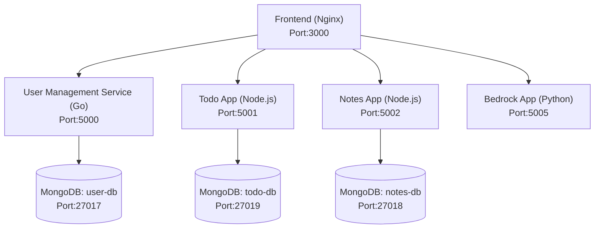

# Polyglot Microservices Application

I built this  **polyglot microservices architecture** with multiple backend services, a frontend UI, and persistent databases. I use this application for building entire **CI/CD** piple which includes enite **Entreprise level** best practises.

---
## 🏗️ Architecture

---

## 📂 Services

| Service | Tech Stack | Port | Database | Description |
|---------|------------|------|----------|-------------|
| **Frontend** | Nginx | 3000 | - | Serves static UI files and injects EC2_IP |
| **User Management** | Go | 5000 | MongoDB (user-db:27017) | User registration and authentication |
| **Todo App** | Pyton | 5001 | MongoDB (todo-db:27019) | Todo items and lists management |
| **Notes App** |  Python| 5002 | MongoDB (notes-db:27018) | Note creation and management |
| **Bedrock App** | Python | 5005 | - | AI-powered features via AWS Bedrock |

---

## ⚙️ Setup & Run

### 1. Clone the repository

```bash
git clone https://github.com/your-repo/polyglot-microservices.git
cd polyglot-microservices
```

### 2. Create `.env` file

In the project root, create a `.env` file:

```env
# Replace with your EC2 public IP
EC2_IP=75.101.212.200

# AWS credentials (for Bedrock App)
AWS_ACCESS_KEY_ID=your_aws_key
AWS_SECRET_ACCESS_KEY=your_aws_secret
AWS_DEFAULT_REGION=us-east-1
```

### 3. Build and start the services

```bash
docker compose up --build -d
```

### 4. Verify containers are running

```bash
docker ps
```

You should see all services running with their respective ports exposed.

---

## 🌐 Accessing Services

| Service | Endpoint | Description |
|---------|----------|-------------|
| **Frontend UI** | `http://<EC2_IP>:3000` | Main application interface |
| **User Management API** | `http://<EC2_IP>:5000/contacts` | User management endpoints |
| **Todo API** | `http://<EC2_IP>:5001/todos` | Todo management endpoints |
| **Notes API** | `http://<EC2_IP>:5002/notes` | Notes management endpoints |
| **Bedrock API** | `http://<EC2_IP>:5005/cheatsheet` | AI-powered features |

## 🛑 Stop Services

```bash
docker compose down
```


